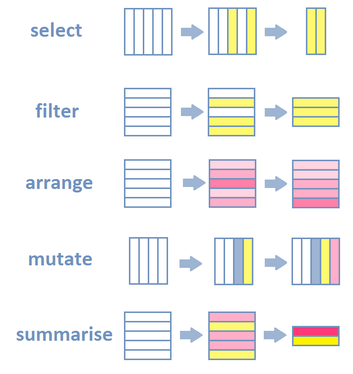

## Setup

```{r setup}
library(tidyverse)
library(RPostgres)
library(dbplyr)
library(ggridges)
```


## The gramma of data manipulation

image [source](http://perso.ens-lyon.fr/lise.vaudor/dplyr/) 

```{r echo=FALSE, fig.height=2, fig.width=1}
# 
```

If you add "grouping" to this list, then nearly everything you want to do is a combination of those verbs/steps. For example, counting

```{r}
head(cars)
```

```{r}
count(cars, speed) |> 
  head()
```
```{r}
cars |> 
  group_by(speed) |> 
  summarize(n = n(), .groups = "drop") |> 
  head()
```


## Load data

```{r}
wrds <- dbConnect(
  Postgres(),
  host = "wrds-pgdata.wharton.upenn.edu",
  port = 9737,
  user = keyring::key_get("wrds_user"),
  password = keyring::key_get("wrds_pw"),
  sslmode = "require",
  dbname = "wrds"
)

# compustat_raw <- 
#   dbGetQuery(wrds,
#   "
#   SELECT gvkey, datadate, conm, fyear, fyr, ib, ceq, at, sale, sich,
#          prcc_f * csho as mve
#   FROM comp.funda
#   WHERE fyear > 1970 
#     AND indfmt = 'INDL'
#     AND datafmt = 'STD'
#     AND popsrc = 'D'
#     AND consol = 'C'
#   ;
#   "
# )

compustat_raw <- 
  tbl(wrds, in_schema("comp", "funda")) |> 
  filter(
    indfmt == 'INDL',
    datafmt == 'STD',
    popsrc == 'D',
    consol == 'C',
    fyear > 1970
  ) |> 
  mutate(mve = csho * prcc_f) %>%
  select(
    gvkey, datadate, conm, fyear, fyr, sich,
    ib, ceq, sale, at, mve
  ) |> 
  collect()

company <- dbGetQuery(wrds, "SELECT gvkey, sic, fic FROM comp.company;")
dbDisconnect(wrds)
```

```{r}
head(compustat_raw)
```

```{r}
head(company)
```


## Sample preparation

First, let's make sure the keys in each table are unique

```{r}
company |> count(gvkey, name = "key_occurence") |> count(key_occurence)
```

```{r}
compustat_raw |> count(gvkey, datadate, name = "key_occurence") |> count(key_occurence)
```

looks good.

Any missings?

```{r}
colSums(is.na(compustat_raw))
```

```{r}
summary(compustat_raw)
```


```{r}
skimr::skim(compustat_raw)
```

Now we merge, clean, and generate key variables. We are going to dplyr verbs for most of this.

```{r}
us_sample_wo_micro <- 
  compustat_raw |> 
  left_join(company, by = "gvkey") |> 
  filter(
    fic == "USA",
    ceq > 10,
    sale > 5,
    at > 0
  )  |> 
  mutate(sic = ifelse(is.na(sich), as.numeric(sic), sich)) |> 
  select(-fic, -sich)

roe_sample <- 
  us_sample_wo_micro |> 
  arrange(gvkey, datadate) |> 
  group_by(gvkey) |> 
  mutate(roe = ib / ((ceq + lag(ceq))/2)) |> 
  filter(
    fyear - 1 == lag(fyear),
    is.na(roe) == FALSE
  ) |> 
  ungroup()
```

```{r}
summary(roe_sample)
```


## Plotting

```{r}
tiu_colors <- list(
  "lightblue" = "#008EC6",
  "gold" = "#CC9933"
)
tiu_colors
```

```{r}
roe_sample |> 
  filter(roe > -0.5 & roe < 0.5) |> 
  ggplot(aes(x = roe)) + 
  geom_histogram(binwidth = 0.01) +
  facet_wrap(vars(fyear))
```


```{r}
roe_sample |> 
  filter(roe < .5 & roe > -.5) |> 
  ggplot(aes(x = roe, y = fyear, group = fyear)) +
  geom_vline(xintercept = 0, color = "grey50") +
  geom_density_ridges(scale = 15, size = 0.35,
                      rel_min_height = 0.02,
                      alpha = 0.3,
                      fill = tiu_colors["lightblue"]) +
  scale_y_continuous(breaks = seq(1970, 2020, 5)) +
  labs(
    y = NULL,
    x = "Return on Equity",
    caption = "Data: Annual RoE of US listed companies with common equity greater $10mn, 1968 - 2019\nRange between -50% and 50% RoE") +
  theme_minimal() +
  theme(panel.grid.minor = element_blank(), 
        panel.grid.major.x = element_blank(),
        panel.grid.major.y = element_line(color = "grey", linetype = "dashed", size = 0.2),
        axis.line.x = element_line(color = "black"))
```


## Exporting the figure

```{r}
ggsave("../out/roe-plot.pdf", width = 7, height = 6, units = "in")
```

