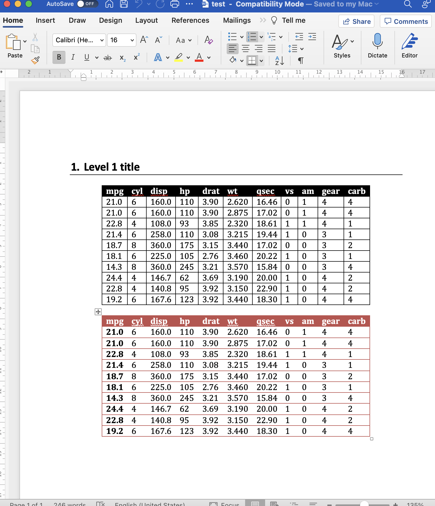

class: left, top

# Why R?

```{css, echo = F}
.regression table {
  font-size: 12px;     
}
.tiny .remark-code { /*Change made here*/
  font-size: 50% !important;
}
```

```{r, echo=FALSE, message=FALSE}
library(tidyverse)
library(palmerpenguins)
library(ggdensity)
show_table <- knitr::kable
```

.pull-left[

Because it is easy:

```{r, eval=FALSE}
# a good life motto
if (sad == TRUE) {
  stop(sad)
  be_awesome()
}
```

if you can read this you can R
]

--

.pull-right[
Also because it is powerful:
1. Most common data analysis, statistical analysis language
1. Free and open source
1. Extremely comprehensive
1. Many useful extensions (authoring, publishing) for academics
1. Vast community

]


---

# I like R because of its ecosystem

R shines in every part of the typical analysis workflow<sup>1</sup>


.footnote[
[1] Source: Hadley Wickham and Garrett Grolemund. 2017. [R for Data Science](https://r4ds.had.co.nz/introduction.html). O’Reilly Media, Inc.
]

---

# R shines at tidying and transforming data

```{r, echo=FALSE}
wide_data <- 
  tribble(
    ~country,      ~`1999`, ~`2000`,
    "Afghanistan",    745,    2666,
    "Brazil",       37737,   80488,
    "China",       212258,  213766,
  )
```


.pull-left[

```{r}
show_table(wide_data)
```
]

.pull-right[

```{r}
long_data <- 
  wide_data |> 
  pivot_longer(c(`1999`, `2000`), 
               names_to = "year", 
               values_to = "cases")
show_table(long_data)
```
]

---

# R shines at explorative and pub. visuals

```{r}
head(penguins, 3)
```


---

# R shines at explorative and pub. visuals

```{r, warning=FALSE, fig.height=3.5, fig.width=7, dev='svg'}
penguins |> 
  ggplot(aes(x = flipper_length_mm, y = bill_length_mm, fill = species)) +
  geom_hdr() +
  geom_point(shape = 21)
```

---

# R shines at explorative and pub. visuals

```{r, echo=FALSE}
pub_theme <- function(){
  theme_minimal() + 
    theme(panel.grid = element_blank())
}
```

.pull-left[
.tiny[
```{r, warning=FALSE, fig.height=3.5, fig.width=7, dev='svg'}
pub_theme <- function(){
  theme_minimal() + 
    theme(panel.grid = element_blank())
}

fig1 <- penguins |> 
  ggplot(aes(x = flipper_length_mm, y = bill_length_mm, fill = species)) +
  geom_hdr(xlim = c(160, 240), ylim = c(30, 70)) +
  geom_point(shape = 21) +
  scale_fill_manual(values = c("darkorange","darkorchid","cyan4")) + 
  pub_theme() + 
  labs(
    title = "Flipper and Bill Length",
    subtitle = "Comparision of three penguin species of the Palmer Archipelago",
    caption = "source: the palmer penguins package",
    x = "Flipper length (mm)",
    y = "Bill length (mm)",
    fill = "Species",
  )
```
]
]

.pull-right[
```{r, warning=FALSE, fig.height=4, fig.width=6, dev='svg'}
fig1
```

]

---

# Big publishing houses use R

[The BBC R Package](https://github.com/bbc/bbplot)


---
class: regression
# R is the language of Stats departments

```{r}
fit1 <- lm(body_mass_g ~ species, data = penguins)
jtools::summ(fit1)
```

---
class: regression
# R is made for flexible modelling

```{r}
covars <- c("bill_length_mm", "bill_depth_mm", "flipper_length_mm")
gen_regeq <- \(x) as.formula(paste("body_mass_g ~ ", paste(covars[1:x], collapse = " + ")))
model_list <- map(1:3, ~lm(gen_regeq(.), data = penguins))
jtools::export_summs(model_list)
```

---

# R excels at communicating results

.pull-left[
.tiny[
```{r}
library(officer)

example_table <- head(mtcars, 10)

doc_table <- 
  read_docx() |> 
  body_add_par("Level 1 title", 
               style = "heading 1") |> 
  body_add_par("  ") |> 
  body_add_table(example_table, 
                 style = "Table Professional") |> 
  body_add_par("  ") |> 
  body_add_table(example_table, 
                 style = "Light List Accent 2", 
                 first_column = TRUE)

print(doc_table, target = "../out/test.docx")
```
]
]
.pull-right[

]


---

# Really. R excels at communicating results


- This presentation was made using the `xaringan` R package (and is hosted on [my site](https://hschuett.github.io/))

--

- Which was made using the `blogdown` R package

--

- [RMarkdown](https://rmarkdown.rstudio.com/) powers a rich set of communication tools: apps, dashboards, websites, reports

--

- For example, the `distill` package makes it easy to produce [paper websites](https://hschuett.github.io/BayesForAccountingResearch/)

---
# Plan for the rest of today


- A simple example of downloading WRDS data to generate a plot for class

- A simple example of fixed effects, clustered standard errors regressions

- Some closing thoughts on R for reproducible science and robust work-flows

#### Slides and example code can be found at [github.com/hschuett/RIntro](https://github.com/hschuett/RIntro)

---

class: center, middle

# On to coding!

Slides created via the R package [**xaringan**](https://github.com/yihui/xaringan).
